# Hadoop High Availability (HA) Cluster

> **ITI Project** — Under the supervision of **Eng. Youssef Etman**

---

## Overview

This project sets up a fully functional **Hadoop High Availability cluster** using Docker containers. It covers HDFS HA, YARN HA, ZooKeeper quorum, and JournalNodes — with automatic failover enabled.

## The README is an overview of the project; for more detail please check the Documentation folder 
---

## Cluster Architecture

| Node | Roles |
|------|-------|
| **master1** | Active NameNode, ResourceManager (rm1), JournalNode, ZooKeeper, ZKFC |
| **master2** | Standby NameNode, ResourceManager (rm2), JournalNode, ZooKeeper, ZKFC |
| **worker1** | DataNode, NodeManager, JournalNode, ZooKeeper |
| **worker2** | DataNode, NodeManager |
| **worker3** | DataNode, NodeManager |


## Cluster Architecture

> ## 🔗 [View Interactive Diagram](https://maro222.github.io/Hadoop-High-Availability-Cluster/media)


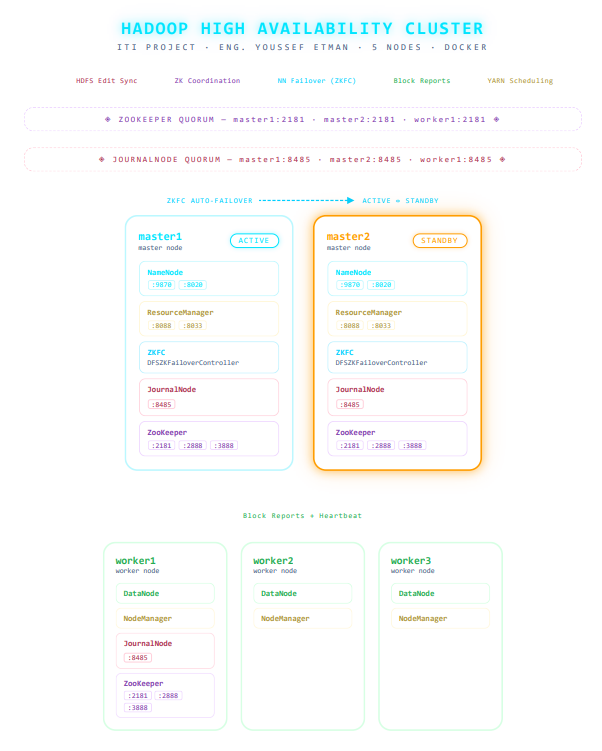
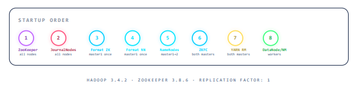
---

## Prerequisites

### 1. Java JDK
```bash
sudo apt update
sudo apt install openjdk-8-jdk -y
```

### 2. SSH & PDSH
```bash
sudo apt-get install ssh pdsh
ssh-keygen -t rsa -P '' -f ~/.ssh/id_rsa
cat ~/.ssh/id_rsa.pub >> ~/.ssh/authorized_keys
chmod 700 ~/.ssh && chmod 600 ~/.ssh/authorized_keys
```

### 3. Hadoop
```bash
wget https://archive.apache.org/dist/hadoop/core/hadoop-3.4.2/hadoop-3.4.2.tar.gz
tar -xzf hadoop-3.4.2.tar.gz
```

### 4. ZooKeeper
```bash
wget https://dlcdn.apache.org/zookeeper/zookeeper-3.8.6/apache-zookeeper-3.8.6-bin.tar.gz
tar -zxvf apache-zookeeper-3.8.6-bin.tar.gz -C /
```

---

## Configuration Files

| File | Purpose |
|------|---------|
| `/etc/environment` | System-wide `JAVA_HOME` |
| `/hadoop/etc/hadoop/hadoop-env.sh` | Hadoop daemon environment variables |
| `/etc/profile.d/hadoop-env.sh` | Hadoop + ZooKeeper exports for all users |
| `core-site.xml` | Default FS, ZooKeeper quorum address |
| `hdfs-site.xml` | NameNode HA, JournalNodes, fencing, replication |
| `yarn-site.xml` | ResourceManager HA, ZooKeeper state store |
| `zoo.cfg` | ZooKeeper ensemble configuration |

---

## Startup Guide

### Phase 1 — Foundation Services (all nodes)
```bash
# Start ZooKeeper
zkServer.sh start

# Start JournalNodes
hdfs --daemon start journalnode
```

### Phase 2 — HDFS HA Initialization (run once on fresh cluster)
```bash
# On master1 only
hdfs zkfc -formatZK
hdfs namenode -format
hdfs --daemon start namenode

# On master2 only
hdfs namenode -bootstrapStandby
hdfs --daemon start namenode

# On master1 and master2
hdfs --daemon start zkfc
```

### Phase 3 — YARN HA
```bash
# On master1 only (once)
yarn resourcemanager -format-state-store
yarn --daemon start resourcemanager

# On master2
yarn --daemon start resourcemanager
```

### Phase 4 — Worker Services (worker nodes)
```bash
hdfs --daemon start datanode
yarn --daemon start nodemanager
```

---

## Verification

```bash
# Check HDFS HA state
hdfs haadmin -getAllServiceState
# Expected: master1 → active | master2 → standby

# Check YARN HA state
yarn rmadmin -getAllServiceState
# Expected: rm1 → active | rm2 → standby
```

---

## Key Design Decisions

- **Fencing method:** `shell(/bin/true)` (fake fence) — chosen after `sshfence` issues caused split-brain scenarios in Docker networking.
- **ZooKeeper `myid` file:** Placed in `dataDir` on each node to uniquely identify servers in the ensemble.
- **Automatic failover:** Enabled via `dfs.ha.automatic-failover.enabled=true` and ZKFC daemons on both master nodes.
- **YARN state store:** Persisted in ZooKeeper using `ZKRMStateStore` for RM HA recovery.

---

## Documentation

| Document | Description |
|----------|-------------|
| `Overview_of_HA_cluster.pdf` | Architecture overview, HA concepts, fencing, and ZooKeeper role |
| `Setup_for_HA_HDFS_Cluster.pdf` | Prerequisites installation steps |
| `Configure_HA_Hadoop.pdf` | Hadoop config files, startup sequence, and troubleshooting |
| `Configure_HA_Zookeeper.pdf` | ZooKeeper `zoo.cfg` settings and `zkfc` commands |

---
## Output

### Running Hadoop Cluster through automated script
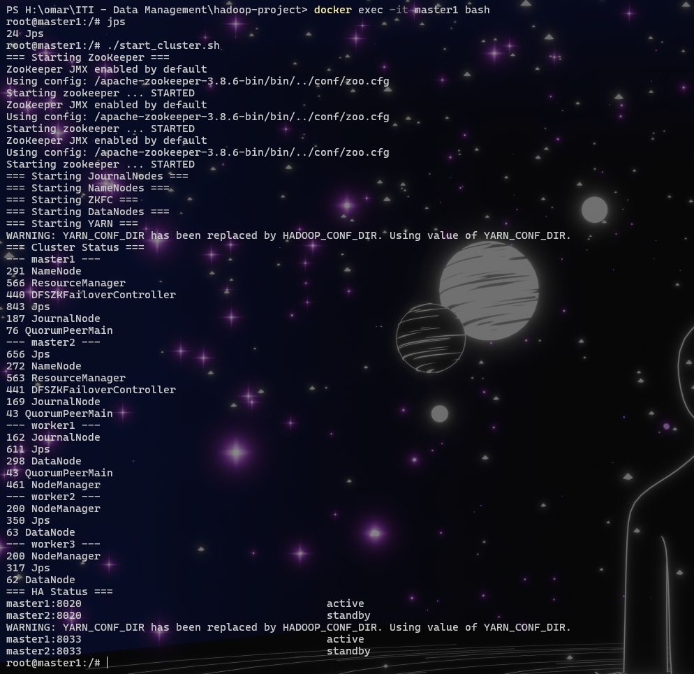

### Active NameNode UI
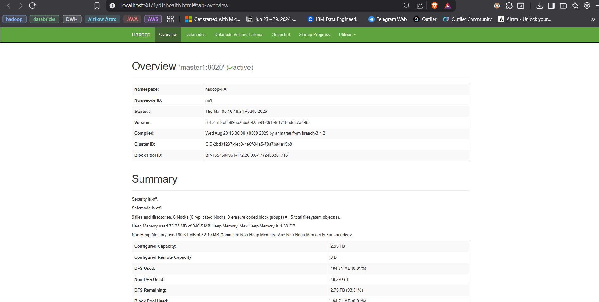

### Standby NameNode UI
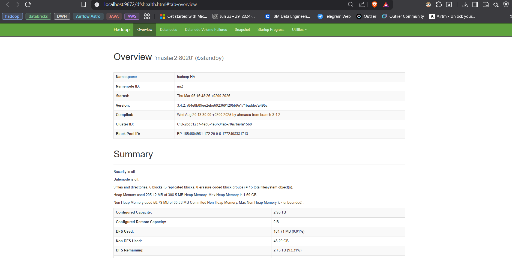

### Yarn UI
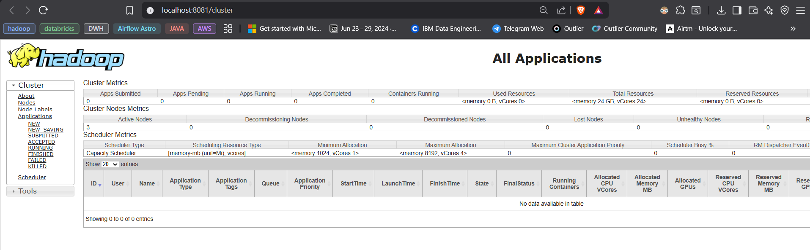

### JournalNode UI
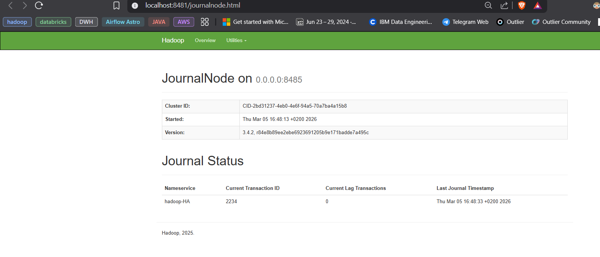

### Testing Automatic failover for HDFS
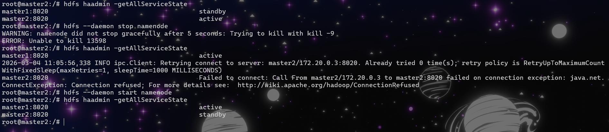

### Testing Automatic Failover for Yarn
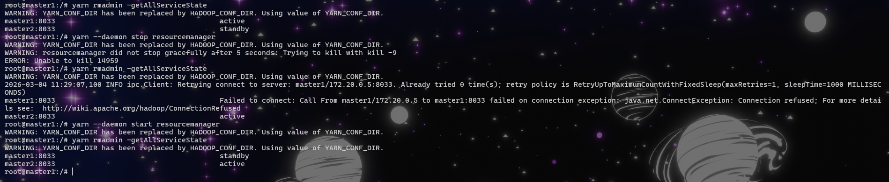

### Ingesting Data
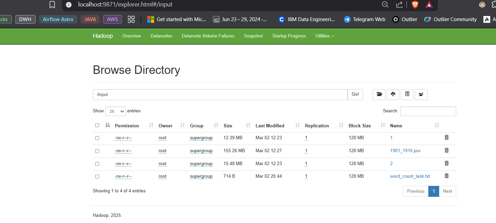

### Running MapReduce Job
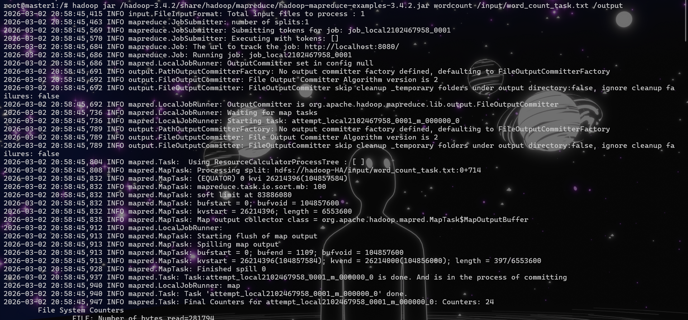
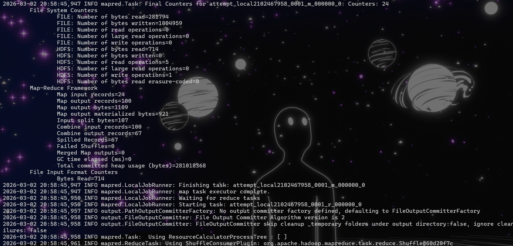
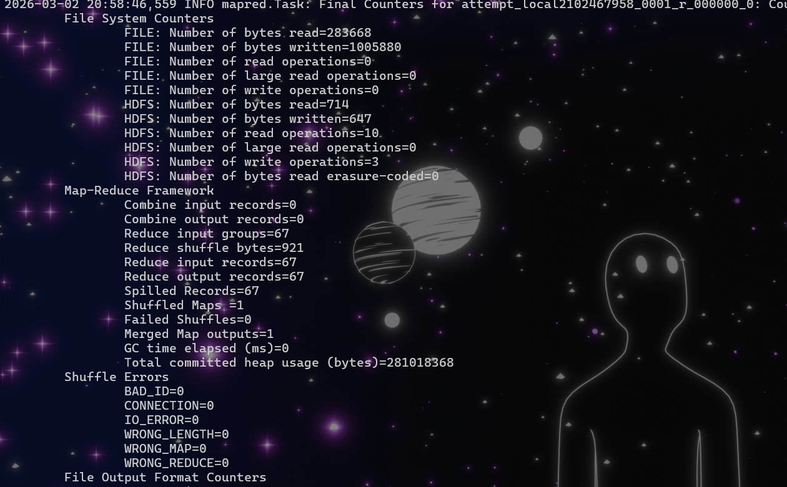

### Output of MapReduce Job

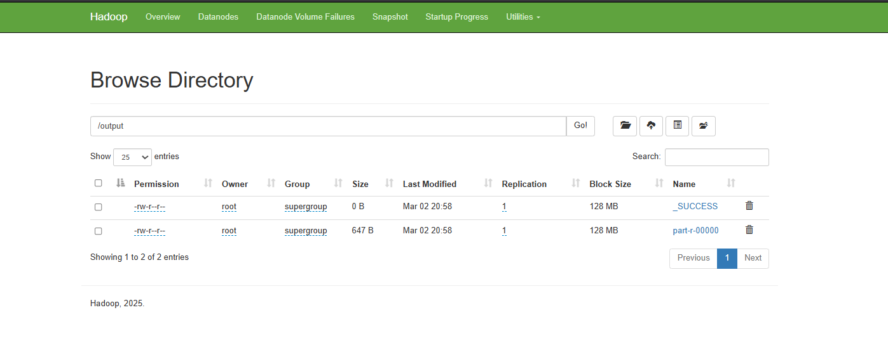

---


## Important Notes

- ⚠️ **Never re-run formatting** (`hdfs namenode -format` or `hdfs zkfc -formatZK`) on a running cluster — it deletes all metadata.
- `bootstrapStandby` must only run **after** the active NameNode is up.
- ZooKeeper and JournalNodes **must be running** before any HDFS formatting.
